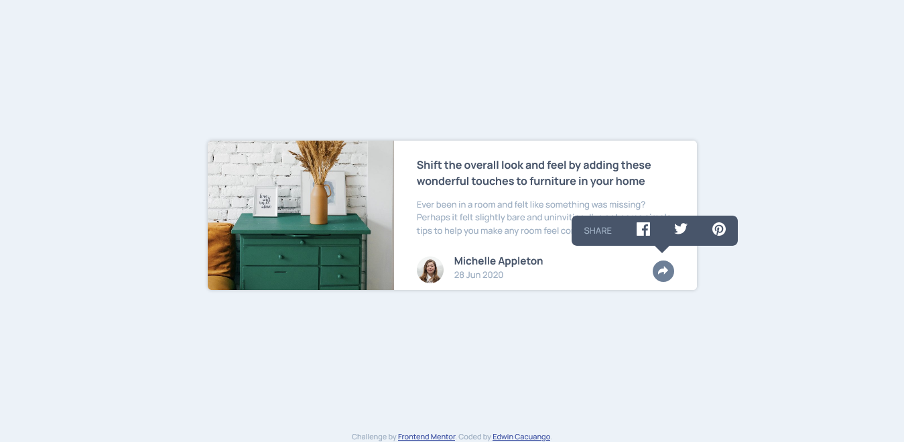

# Frontend Mentor - Article preview component solution

This is a solution to the [Article preview component challenge on Frontend Mentor](https://www.frontendmentor.io/challenges/article-preview-component-dYBN_pYFT). Frontend Mentor challenges help you improve your coding skills by building realistic projects. 

## Table of contents

- [Overview](#overview)
  - [The challenge](#the-challenge)
  - [Screenshot](#screenshot)
  - [Links](#links)
- [My process](#my-process)
  - [Built with](#built-with)
  - [What I learned](#what-i-learned)
  - [Continued development](#continued-development)
  - [Useful resources](#useful-resources)
- [Author](#author)
## Overview

### The challenge

Users should be able to:

- View the optimal layout for the component depending on their device's screen size
- See the social media share links when they click the share icon

### Screenshot



### Links

- Solution URL: [GitHub](https://github.com/EdwinCacuango/article-preview-component)
- Live Site URL: [Netlify](https://inspiring-wright-2678cf.netlify.app/)

## My process

### Built with

- Semantic HTML5 markup
- CSS custom properties
- Flexbox
- CSS Grid
- Mobile-first workflow

### What I learned

I learned how to add and change styles withe JS. It's so simple, but I always was afraid of used it :(


```js
shareBtn.addEventListener("click", () => {
  authorSection.classList.toggle("active") 
});
```


### Continued development

I have a big problem with the shared box above the arrow. How to position it was so dificult, and the final result it's not responsive. Let me khow how to fixed that!

### Useful resources

- [Cambiar la Clase de un Elemento con JavaScript (sin jQuery)](https://www.youtube.com/watch?v=y2FDDzzl2X8) - This helped me to create the function for change styles. I really liked this pattern and will use it going forward.
- [Cambiar el color de un icono SVG por CSS de forma sencilla en WordPress o HTML](https://www.youtube.com/watch?v=wh2yuslnGG4) - This is an intersting video when I learned how to change the color of a svg. 


## Author

- Frontend Mentor - [@EdwiCacuango](https://www.frontendmentor.io/profile/EdwinCacuango)
- Twitter - [@edwincacuango](https://www.twitter.com/edwincacuango)

